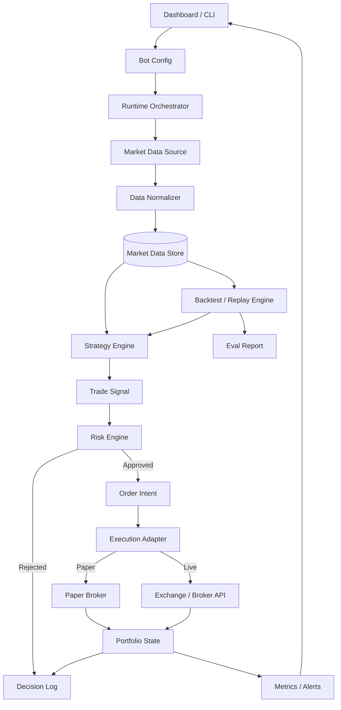

```mermaid
flowchart TD
    UI[Dashboard / CLI] --> Config[Bot Config]

    Config --> Runtime[Runtime Orchestrator]

    Runtime --> DataSource[Market Data Source]
    DataSource --> Normalizer[Data Normalizer]
    Normalizer --> Store[(Market Data Store)]

    Store --> Strategy[Strategy Engine]
    Strategy --> Signal[Trade Signal]

    Signal --> Risk[Risk Engine]
    Risk -->|Rejected| Audit[Decision Log]
    Risk -->|Approved| Intent[Order Intent]

    Intent --> Executor[Execution Adapter]
    Executor -->|Paper| PaperExec[Paper Broker]
    Executor -->|Live| Broker[Exchange / Broker API]

    PaperExec --> Portfolio[Portfolio State]
    Broker --> Portfolio

    Portfolio --> Audit
    Portfolio --> Metrics[Metrics / Alerts]
    Metrics --> UI

    Store --> Backtest[Backtest / Replay Engine]
    Backtest --> Strategy
    Backtest --> Report[Eval Report]
```
